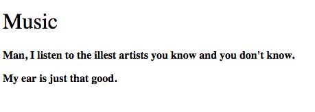
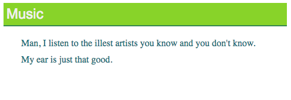

# Basic Properties
What I'm aim to do during this lesson is give you an intro to some of the more widely known CSS properties. There are many CSS properties and you'd be hard pressed to find someone who has all of them memorized. That being said, we won't be going through every property. This will serve as an intro that can get you ready to dive into deeper levels.

## Our HTML Page
For the rest of this lesson, all the CSS we make will apply to this HTML page. Put all rules in the *style.css* file:
```html
<!doctype html>
<html>
    <head>
        <title>Music</title>
        <meta name="description" content="Let's demonstrate some CSS">
        <meta name="keywords" content="html tutorial css linked">
        <link href="style.css" rel="stylesheet">
    </head>
    <body>
        <h1>Music</h1>
        <p>Man, I listen to the illest artists you know and you don't know.</p>
        <p>My ear is just that good.</p>
    </body>
</html>
```

## Text Properties
There are many rules that we can apply to make our text look a little more bit more cool. Let's see them now.
### Font family
The *font-family* property is used to define the font we're using. You can use any font that is installed on the clients computer. Here's an example of property usage:
```css
h1 {
    font-family: Times New Roman;
}
p {
    font-family: Verdana;
}
```
Here's the result:  

### Font Size
*Font-size* defines the text size and can be measured in a few units. The most common in *px*.
```css
h1 {
    font-size: 30px;
}
p {
    font-size: 16px;
}
```
Here's the result:  

### Font Weight
The *font-weight* property defines how thick the text will be. The values we can use are:
* lighter
* normal
* bold
* bolder

Be aware that every font can't use every fone-weight type.
```css
h1 {
    font-weight: normal;
}
p {
    font-weight: bold;
}
```
Here's the result:  

## Color Properties
Color is fairly complex but we will touch on the essentials. There are two different ways to define color. One is to literally write the name of the color, like *red*. The other is to use hexidecimal values, such as #9ACA42. The scale for hexidecimal is from 0-9, and then A-F to represent 10-15. The first two characters in a hexidecimal value respresent the amount of *red*. The third and fourth characted represent the amount of the *green*. The last two represent the amount of *blue*.
### Color
The most basic color property is *color*. This defines the color of the text.
```css
h1 {
    color: #9ACA42;
}
p {
    color: #357180;
}
```
Here's the result:  

### Background Color
The *background-color* property lets us define the background colour for an element.
```css
h1 {
    background-color: #9ACA42;
}
p {
    background-color: #A0D2DC;
}
```
Here's the result:   

## Spacing Properties
The spacing of elements can make all the difference on a web page. You don't want your content looking cluttered and risk the chance of someone never wanting to come back. Let's look at some spacing properties.
### Padding
*Padding* refers to the space around the content but still within the element. I've use the *background-color* property below to make this concept easier to see.
```css
h1 {
    padding: 5px;
    background-color: #9ACA42;
}
p {
    padding: 5px 10px 8px 30px;
    background-color: #A0D2DC;
}
```
Here's the result:   
  
We can define padding in 3 ways:
* A single value that will be applied to every side.
* Two values -  The first value defines the top and bottom padding. The second unit defines the left and right padding.
* As four values - The first applies to the top, the second to the right, the third to the bottom and the fourth to the left.
### Margin
Margin defines how much space is around the element. The 3 ways for defining padding also applies to how we can define margin as well. For example:
```css
h1 {
    margin: 10px;
    background-color: #9ACA42;
}
p {
    margin: 5px 10px 8px 30px;
    background-color: #A0D2DC;
}
```
Here's the result:   
 
### Border
Border is the line between the padding and the margin. I'll use the basic *border* property here but there are many properties for changing the look of the border.
```css
h1 {
    border: 2px solid #E9B82B;
}
p {
    border: 1px dashed #4D8353;
}
```
Here's the result:   
 
## Let's bring it all together now!
Now that we've got a couple CSS properties under our belt, let's bring em' all together for a great look.
```css
h1 {
    font-family: Arial;
    font-size: 24px;
    font-weight: normal;
    color: #efefef;
    background-color: #9ACA42;
    margin: 2px 0px 20px 0px;
    padding: 5px;
    border-bottom: 2px solid #4D8353;
}
p {
    margin: 10px 0px 10px 30px;
    color: #357180;
    font-size: 16px;
}
h1 {
    font-family: Arial;
    font-size: 24px;
    font-weight: normal;
    color: #efefef;
    background-color: #9ACA42;
    margin: 2px 0px 20px 0px;
    padding: 5px;
    border-bottom: 2px solid #4D8353;
}
p {
    margin: 10px 0px 10px 30px;
    color: #357180;
    font-size: 16px;
}
```
Here's the result:   


## Stick around for the next episode...
In the next episode we'll be going over CSS selectors. They allow us to get very specific with what elements we apply rules to. See you next time!